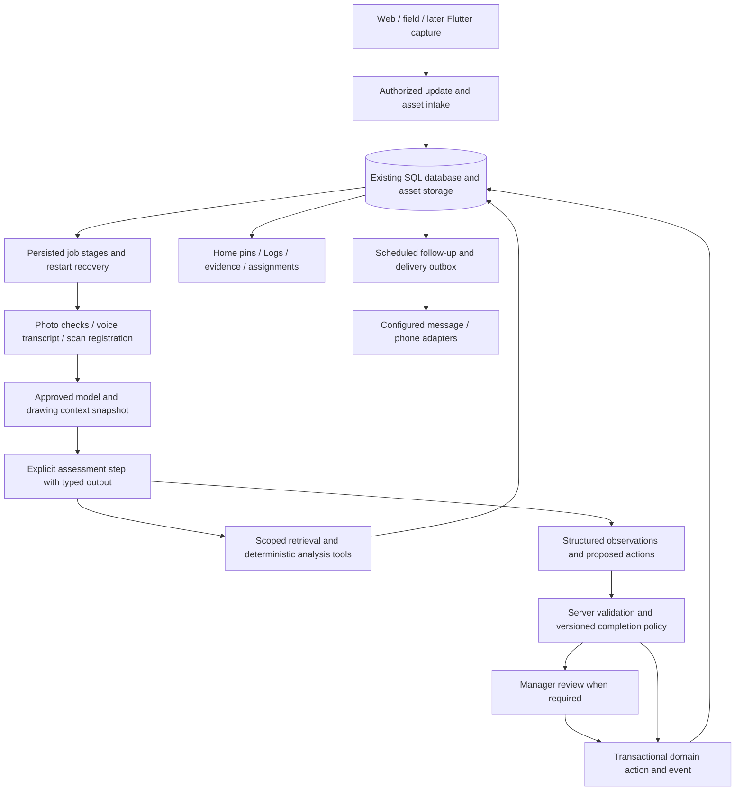

# Architecture

## Current source, latest upstream baseline

Baseline `aa3692b` (October 6, 2026): React/TypeScript in `web/`; shared three.js viewer in `web/src/viewer/`; FastAPI, SQLAlchemy, Alembic and Python services in `backend/`. Local SQLite and optional PostgreSQL are already supported. See [MODEL_WORKFLOW](MODEL_WORKFLOW.md) and [STATUS](../STATUS.md) for actual behavior and verification.

The chosen workspace in `web/src/workspace/` is now mounted at `/`, with compatibility redirects from `/demo/...`. It stores sample work records locally. Its `assessmentJobs` in `web/src/workspace/state.ts` are a prepared handoff, not backend runs or production data. Legacy connected pages are retained for integration and are no longer publicly routed. Backend APIs still enforce authorization; sign-in-free UI testing does not authorize server access. The real Duplex model is context; the sample work/photos do not establish installation evidence.

Existing integration points:

| Source | Current behavior | Placeholder AI integration |
|---|---|---|
| `backend/app/api/progress.py:create_upload` | Scoped photo upload, offline identity and model revision audit; worker claims reopen review. | Start a server-owned run after receipt; retain upload identity, model scope and evidence. Add voice/scans through reviewed asset contracts rather than passing them to the photo decoder. |
| `backend/app/vision/client.py` | Gemini presence verdicts with structured response validation. | Reusable provider/photo preprocessing experience; new assessment schemas and drawing context require evaluation. |
| `backend/app/services/vision_jobs.py` | Legacy photo analysis; confidence-based opt-in approval and skip-done behavior. | Do not run both legacy and Placeholder AI policies on the same submission. Disable/retire the legacy path for migrated projects through an explicit rollout plan. |
| `backend/app/services/progress.py` | Photo-evidence protection, claims, approval and status events; stale baseline guard. | Preserve evidence protection; migrate semantics to separate AI observation, human acceptance and inspection. |
| `backend/app/api/drawings.py` | Drawing files, reviews and conversion services. | Retrieve only approved, applicable source revisions with page/detail IDs; generated model plans remain distinct from approved drawings. |
| `backend/app/jobs.py` | DB-backed handler registry, optimistic claim, inline tests/thread worker. | Run assessment stages here; add leases, persisted stages and recovery before production durability claims. |
| `backend/app/services/notify.py`, `events.py` | In-app notifications and append-only events. | Reuse for review/retake requests and action audit; external messages/calls need new channel/outbox adapters. |
| `web/src/workspace/Home.tsx`, `Logs.tsx`, `state.ts` | Chosen public workspace with shared model selection and local sample work/assessment state. | Integrate persisted agent outcomes here; preserve the selected interface and existing model. Do not remount the retired route tree or silently mix sample and server evidence. |

Old `dev` is preserved at `d6597d6`. It contains profile/people/calendar work absent from this baseline. An earlier trial merge against `0a79d2d` reported nine textual conflicts and duplicate Alembic revision `0007`; importing that branch requires BEAV-000 and a fresh comparison against the latest main, not copying all models/migrations into this branch.

## Implemented review-only photo slice

`backend/app/agent/` implements `visible_component_presence` using approved drawing **extraction primitives**, not visual interpretation of a raw DXF/PDF sheet. Conversion freezes drawing plan/original-file hashes in `AgentReference`; approved model revisions bind components through existing SheetId/PlanId properties. Imported IFCs and pre-migration models without this provenance abstain. Existing drawings are not retroactively described as approved snapshots.

The worker submits photos through the existing scoped upload API, then creates an assessment. `AGENT_ENABLED=true` makes new uploads skip legacy vision auto-approval. The provider adapter makes one typed, tool-free Gemini request per attempt; the server validates every returned component, photo and source ID. All checks have `completion_eligible=false`. Missing/unsupported context produces a retake proposal; provider errors persist a public failure. No fake offline/model fallback exists.

The local demo pins stable `gemini-3.8-flash` with medium thinking; deployments use `VISION_MODEL`/`VISION_EFFORT`. This is a capability-based selection, not an accuracy ranking. The [model decision](decisions/0001-placeholder-agent-harness.md#gemini-selection-for-the-two-person-demo) separates current photo, recorded transcription and read-only text processing from planned live voice. No additional model router is installed.

Migration `0008` adds `AgentReference`, `AgentRun`, `AgentAction` and `AgentRequest`. Run JSON owns the bounded context and check results; action rows own immutable fingerprints and decisions. Existing jobs dispatch execution. Run leases fence late results; recovery permits at most two attempts, then fails visibly. A review wait holds no provider session. Scope is checked on every read and before decisions. Short transactions lock the project, run, sources and targets; ORM records refresh after waiting. Identical submissions/decisions replay, competing decisions conflict, and stale evidence/drawings/model/policy cannot complete work.

Freshness checks rehash original drawing/photo bytes during execution and review; replaced or missing assets reject the result/decision. A newer explicitly scoped submission supersedes only intersecting components. A newer zone/trade submission without explicit component claims conservatively covers that whole scope; independent component reviews remain valid.

The `/agent` page lives inside the chosen workspace and requires existing backend accounts. Worker photos and PM review use shared server records, authorized geometry and source/evidence references. Model pins and the saved list select the same run; accepting a current presence proposal records **human** completion through existing progress services. Relevant open issues block that acceptance. Polling refreshes both identities' model projections; the PM can preview a current drawing, with revision revalidation at acceptance. Agent API responses and authenticated client requests bypass browser/service-worker caches.

Current bounds: 1–6 photos, 1–40 scoped components, 100 KB serialized context, last 12 status events, at most 40 returned observations, 6,000 output tokens, a configurable 1–300 second provider timeout (60 by default), and two attempts after lease loss. Media preprocessing uses the existing bounded JPEG copy. Token usage/time are persisted privately. Currency quotas, fair scheduling, full input-token accounting, PostgreSQL concurrency and multi-process capacity remain unverified work; these caps do not establish a production spending guarantee.

LangGraph remains a preferred future pause/resume adapter; this slice uses ordinary application-owned transitions and SQL memory. No LangGraph/checkpointer, MCP connector, LiDAR, calendar, live voice streaming or external messaging is installed. Recorded voice and read-only text helpers are implemented below. Public Home/Logs retain sample records; connecting those views to authorized agent records is still BEAV-003. `/agent` tests do not constitute the complete six-scenario two-person acceptance or real-site model validation. See [task evidence](TASKS.md) and [local setup](DEVELOPMENT.md#placeholder-ai-agent-demo).

## Implemented recorded voice and read-only helpers

Migration `0009` adds `AgentVoice` and `AgentSummary` without changing existing records. `backend/app/agent/voice.py` validates audio signatures, an 8 MiB limit, project/zone/trade scope and intake idempotency. Original bytes are retained behind authenticated reads and hash-checked before use. Captured time, when supplied, is normalized to UTC; receipt time does not establish when physical work occurred. A fenced job permits at most two total attempts. Provider failures retain audio and expose a sanitized error. Only the author may correct a completed transcript with the expected revision; the original provider text is preserved. Transcripts are worker statements and cannot establish completion.

Recorded transcription uses `AGENT_VOICE_MODEL` (default `gemini-3.5-transcribe`) through the documented Interactions REST endpoint. Its HTTP transport has no automatic retries; persisted jobs own the retry budget. The installed SDK's Interactions bridge retries even with a nominal zero setting, so this small adapter avoids multiplying attempts. Default transcription timeout is 120 seconds, configurable from 1–300. No live WebSocket transcription or phone integration is implemented.

`backend/app/agent/helpers.py` supplies authorized current components to editable suggestions, with at most five results and a 15-second default text timeout. Client input revisions discard late drafts; server scope/context revalidation rejects stale results. `AGENT_TEXT_MODEL` defaults to `gemini-3.5-flash-lite`. Helpers have no tools and perform no assignment or progress writes.

Daily briefings are scoped per actor, project, local date and IANA timezone. SQL applies authorization before the 100-event window. The model selects existing event IDs; server code renders their statements and citations, preventing invented completion/status counts. Coverage is always labeled partial because this projection includes selected activity types. GET reads saved results without inference; explicit refresh invokes the model. Changed source/scope digests invalidate prior statements. These summaries do not reconstruct historical geometry or certify physical capture dates.

`web/src/workspace/AgentTools.tsx` connects briefing refresh, suggestions, file upload, browser recording, authenticated audio playback and editable transcripts to `/agent`. Browser recording requires `MediaRecorder` and microphone permission on localhost/HTTPS; other clients can upload recorded files through the platform-neutral contract. Copying a transcript into an update note is explicit. Live provider access, real microphone behavior and noisy-site transcript accuracy remain unverified here.

## Proposed Placeholder AI boundary

The public copilot currently receives a bounded browser-local problem packet assembled by `web/src/workspace/copilotContext.ts`: selected work, owner/deadline, reference/evidence limitations, related work, partial owner workload and recent selected-work activity. Fields are capped and lower-priority records omitted to keep valid JSON within the existing 6,000-character API contract. `backend/app/agent/provider.py` asks for a practical resolution plan and missing scheduling information. This improves advice; it does not add a tool loop, calendar access or write authority. Browser-local records remain untrusted sample context.

The current core ownership flow uses `CopilotAssignment.tsx` and the existing local `assign` transition: PM confirmation records the responsible trade/instruction without requiring a calendar or inventing a deadline, preserving completion and checking source/owner freshness. The prior BEAV-014 scheduling experiment retains its `calendarSnapshot.ts` and `coordination.ts` data/validation helpers for existing local records, using the existing per-model WorkspaceState/transition/storage boundary. Manager-confirmed duration/qualification and an explicitly covered imported calendar snapshot gate slots; confirmation rechecks current source/owner/deadline and local reservations. Historical calendar assignment, in-app follow-up and explicit replies retain local audit events; physical progress is unchanged and completion cancels pending reminders. The read-only HTTP chat contract is unchanged, and browser-local confirmations do not grant server authority. Backend assignment/communication invariants remain BEAV-011/007 work.

`/field-capture` is a compact client of the existing authorized photo/run/voice APIs, reusing Agent's scoped project, retry identity and evidence/review workflow. It accepts scan screenshots as ordinary images; raw scan parsing is not implemented. Browser camera selection and secure-context audio capture are client-specific behavior a later Flutter client would replace while reusing the same contracts.

BEAV-011 is the next agency boundary: bind the selected canvas to an authorized database project, retrieve the problem's relevant sources, determine qualified members and calendar free/busy, propose a task/time/assignee, then apply under manager confirmation or an explicitly saved automatic-routing policy. Recheck membership, source revisions, availability and duplicate identity at execution. The current read-only chat contract does not authorize these mutations; action/eligibility/calendar contracts require review before implementation. Manual availability labels cannot establish a free time slot. Existing issue create/assign APIs provide domain foundations, not a released autonomous scheduling workflow.

See [requirements](../.kiro/specs/placeholder-agent/requirements.md) and [ADR 0001](decisions/0001-placeholder-agent-harness.md). The following diagram is the target boundary. The photo/review, recorded-voice and read-only helper subsets described above are implemented.

RunContext carries authenticated initiating actor/service identity, project membership and scope, approved model version, source snapshot and workflow kind. The model cannot override these through tool arguments. Persist only needed context, public conclusions and tool audit metadata; provider secrets and private reasoning are not client output.

One orchestrator initially runs separate assessment, assignment assistance and analysis workflows with different allowlisted tools. Model calls occur at named interpretation/drafting steps; code decides valid transitions and stop conditions. Prompts and context assembly are versioned application code, not hidden framework defaults. Autocomplete is a small read-only request. Follow-up dispatch is deterministic scheduling plus refreshed eligibility checks; an LLM may compose a message but does not sleep waiting for a reply.

LangGraph is the preferred pause/resume adapter, subject to BEAV-003 proving a persistent saver and restart behavior. It runs inside the backend; existing jobs dispatch execution. Graph state references domain records by ID/revision and cannot become a second progress database. Replayed nodes revalidate business state; side effects require domain idempotency even when a checkpoint exists.

## Business ownership and the two-person demo

Existing `Organization`, `OrgMembership`, `Project` and `ProjectMember` records in `backend/app/models/__init__.py` already provide company/project membership foundations. `backend/app/rbac.py` enforces project permission plus trade/zone scope. Crew reporting lines, work qualifications, calendar-backed scheduling and customer-specific sharing need additional reviewed contracts; they are not implicit in those records.

The first demo has one worker and one PM, in separate sessions, on one project. Reuse existing backend identities (`trade` permission role for the worker, `pm` for the manager), upload/storage services and the model. Connect identity and project selection inside the chosen root workspace; do not remount the retired route tree. The current sample persona/local storage cannot establish shared authorized state. The selected interface may remain sign-in-free in explicit sample mode, but private persisted demo records need scoped identity; do not bypass API auth to connect them.

| Person | Business responsibility | Agent assistance | Authority |
|---|---|---|---|
| Worker / foreman | Report work and provide requested evidence. | Suggest note/location, inspect submitted photos and explain missing views. | May submit within assigned scope; cannot approve their own work as the PM. |
| PM / superintendent | Approve references, review exceptions and coordinate people. | Explain observations, propose actions and summarize persisted events. | Applies current proposals under project permissions; enables released automation explicitly. |
| Trade lead (later) | Route trade work and manage corrections. | Suggest qualified people and outstanding tasks. | Assignment authority must be designed separately; no new role is silently introduced. |
| Customer / client (later) | Understand shared progress and requested decisions. | Summarize permitted records. | Read/share permissions do not imply administrative ownership or inspection authority. |

The business loop is **worker submits → agent assesses → PM reviews → both see persisted progress**. Findings/corrections reuse that loop with another submission. Green human-accepted work records the real reviewer; automatic AI completion remains gated by a released policy. See [demo acceptance](../.kiro/specs/placeholder-agent/requirements.md#current-demo-boundary--at-least-two-people).

## Scaling path for crews and projects

This is a proposed path, not a benchmark or infrastructure installed by this task. Start the two-person demo with one API process, existing SQL/storage and the existing background worker. Improve run recovery and revision-safe writes for correctness before adding machines. No per-person agent service, Redis, Kubernetes or vector database is required for this demonstration.

One orchestrator means **one shared workflow definition**, not one global serial conversation. Each submitted business event has its own saved run ID, project/actor scope and source snapshot. Several workers can execute separate runs concurrently. A run waiting for a reviewer is persisted and releases its worker; review later resumes with fresh permission/reference checks. [LangGraph checkpoints](https://docs.langchain.com/oss/python/langgraph/persistence) can persist run execution; the domain database owns the business result.

| Growth concern | Proposed mechanism | Demo versus later |
|---|---|---|
| Many uploads at shift end | Persist received evidence and enqueue assessment before responding; cap model concurrency separately from request handling. | Required independent intake/result states for the demo. Burst quotas/fairness are later load work. |
| More API/worker instances | Stateless request handlers, shared PostgreSQL/domain state, shared asset access, bounded worker processes and persistent checkpoints. | Single process/local assets suffice for two people. Multiple instances require load/recovery tests and compatible shared storage first. |
| Two decisions on the same work | Unique submission/action keys, revision-checked transactions and all evidence retained. | Required for the demo, including submission retry and competing reviewer decisions. |
| Worker crashes or loses its lease | Lease expiry/reclaim plus a fencing generation checked before writes; checkpoints resume stages; side-effect keys prevent replay duplicates. | Restart correctness belongs to BEAV-003. Agent runs now have leases/recovery; broader queue and multi-instance recovery remain later work. |
| One busy contractor consumes capacity | Organization/project quotas, fair scheduling, provider-rate budgets and separate short suggestion versus long media-processing capacity. | Deferred to BEAV-009; define fairness/latency targets with the actual workload. |
| Large histories and model files | Scoped/indexed/paginated queries; summaries from saved events; cache only under permission/source-version keys; load required model layers. | Preserve scope now; measure query/media/GPU costs before adding caching/CDN services. A larger agent does not improve renderer performance. |
| People work across projects | Current project membership/qualification checks; authorized free/busy across commitments; atomic reservation only for explicitly exclusive assignments. | Deferred until assignment contracts exist. Private task details from another project must not leak in candidate reasons. |

For a shared database queue, PostgreSQL [row locking and `SKIP LOCKED`](https://www.postgresql.org/docs/current/sql-select.html) can support concurrent job claims. This is a candidate implementation detail, not sufficient recovery by itself: leases, fencing and action deduplication still need testing. Local SQLite stays a development option; do not claim production concurrency from a local demonstration.

Every read/tool/action resolves project membership server-side. The server derives the organization from the project, rather than trusting a client-supplied company ID. Checkpoint IDs are locators, not access tokens; loading them requires the same scope checks. Organization membership alone does not grant every project's records. Scoped summaries and connector sessions must follow those same boundaries.

Capacity is driven by update bursts, photos/scans per update, model latency/rate limits and rendering load, not just headcount. Measure intake/result latency, oldest queued run, retry/failure rate, provider usage/cost and review wait time separately. Review wait measures human workload rather than processing capacity. Wider rollout targets and benchmarks are deferred until after the two-person loop works.

## Evidence-to-progress flow

1. Receive an idempotent upload/assets submission and confirm authorized project/work/component location. Freeze the approved model revision, applicable sheet/specification revisions, evidence checksums and policy version. A missing approved reference goes to review.
2. Normalize assets. Check image quality; transcribe recorded audio; process supported scan exports. Preserve originals and derivation links.
3. Retrieve just the relevant IFC properties, sheet pages/crops, approved changes and prior observations/issues. Match location using stable IDs and confirmed scope; a similar-looking room is not enough.
4. Run released checks. Produce named outcomes (`pass`, `potential_discrepancy`, `insufficient_evidence`, `unsupported`, `failed`) and scope-limited observations, with evidence/source references and limitations. Hidden conditions or required measurements absent from evidence remain uncheckable.
5. Validate every returned component and asset against the server snapshot; compute automatic eligibility with deterministic policy rules. No self-reported-confidence shortcut. Pending/unreleased checks produce review proposals only.
6. Recheck revisions, actor permissions, newer evidence and relevant unresolved issues immediately before committing. Apply eligible observations and events transactionally; bind reviewed actions to a fingerprint and resource revision. Reject stale proposals with a conflict.
7. Project persisted component states into the existing renderer and summarize cited events. Room/section progress aggregates only the required defined work scope; accepted task completion is not an inspection certificate.

New evidence can reopen completed work. A scan never rewrites approved IFC geometry. Legacy approvals retain their real provenance; migrations must not relabel them as human acceptance or newly validated Placeholder AI results.

## Tools and policy

| Tool group | Allowed initial capabilities | Application enforcement |
|---|---|---|
| Read context | Retrieve scoped work/components, approved source details, prior evidence/issues and history. | Project/trade/zone RBAC on each access; bounded pages/rows/image crops. |
| Assess | Image inspection with typed output; registered scan measurements through deterministic adapters. | Supported-check registry; input/output validation; policy computes eligibility. |
| Suggest | Draft note/evidence requests; rank members after role/calendar/workload queries. | Editable proposals; no authorization-role-as-qualification; unavailable data stays unknown. |
| Analyze | Progress change/history/workload aggregates, source-linked answers. | Parameterized bounded queries and timezone-aware periods; no arbitrary SQL or Python execution in MVP. |
| Propose actions | Propose review, scoped progress, issue, assignment or follow-up records. | Side effects applied by domain services after policy/approval checks, with revision and idempotency guards. |

Initial proposed operational limits: eight model requests per run, sixteen tool calls, bounded media crops and a five-minute worker attempt. These are configurable starting caps to measure, not achieved latency or throughput. Autocomplete gets a separate short timeout/debounce path. Persist usage/provider latency and expose a useful unavailable result rather than blocking capture.

## Durable state and retries

Implemented records are listed above; checks are stored in run JSON and proposals in `AgentAction`. Future asset/follow-up/delivery records need their own reviewed contracts. Existing Upload/Photo/Verification/Job/Event identities remain authoritative for their domain facts.

Run state: queued → running → awaiting_review / completed / failed / superseded / cancelled. Review decisions apply individual immutable proposals; a terminal result does not imply every proposed action was approved. Record action status independently. Restart recovery reclaims expired leases and resumes from persisted stage inputs. Cancellation/supersession is rechecked before each mutation.

The first slice uses a unique upload/input hash and scoped idempotency aliases, a lease token, and immutable action fingerprints. Future multi-stage execution needs stage-specific deduplication. Record intended external sends transactionally in an outbox; use provider idempotency keys and deduplicated callbacks. An ambiguous delivery timeout stays unknown pending reconciliation, rather than triggering an immediate duplicate phone call. Exactly-once delivery to an arbitrary external carrier is not promised.

Follow-up eligibility includes unresolved work, current recipient membership, contact/channel authorization, quiet hours, attempt limits and opt-out. Stop on resolution or cancellation; new replies become new evidence linked to the original task. Revalidate calendar availability at assignment time, not just when suggesting a candidate.

## Memory and model capability

The model is stateless between calls. The backend reconstructs a bounded context from these separate records:

| Memory | Contents and authority | Retrieval/lifecycle |
|---|---|---|
| Working state | Run ID, stage, input snapshot, attempts, tool results, pending proposal and usage budget. | Persist before waits; resume from durable checkpoints. Use a database-backed saver, not an in-memory saver, for restart acceptance. |
| Project facts | Approved drawings/model revisions, evidence, work history, issues, members, qualifications and calendar observations. | Query by authorized project, confirmed location and applicable revision. Refresh time-sensitive records before acting. |
| Confirmed preferences/decisions | Manager-selected assignment/notification policies and accepted review reasons, with author, time, scope and source. | User-editable and revocable. An inferred preference or model-authored summary cannot create authority. |
| Retrieved context | Relevant source excerpts/crops and short prior-result summaries containing source IDs. | Rebuild for each step; summaries aid retrieval and never replace originals. Source changes invalidate dependent results. |

For local development, SQLite can hold run/domain records and a compatible persistent checkpoint store; production can use PostgreSQL. [LangGraph persistence](https://docs.langchain.com/oss/python/langgraph/persistence) distinguishes thread checkpoints from longer-lived stores. Select a saver and test concurrent claims/migrations before adopting it; no framework checkpoint store has been installed; the current run state is already persisted in SQL. Avoid copying all project records into a second framework memory store.

Memory supplies context; it does not train the model. Capability comes from a suitable multimodal model, reviewed prompts, typed tools, approved drawings and measured performance on actual site evidence. Start with the existing configured provider and compare alternatives on the same corpus. Improve the failing check/context before adding more autonomous steps. Calendar history can support a suggested estimate, but missing calendars or stale events remain explicit unknowns; availability is not learned as a guaranteed fact.

## iPhone LiDAR path

[RoomPlan](https://developer.apple.com/augmented-reality/roomplan/) exports USD/USDZ room geometry; Apple's [sample workflow](https://developer.apple.com/documentation/roomplan/providing-custom-models-for-captured-rooms-and-structure-exports) also uses serialized room JSON. Actual scan app/format is unresolved. JSON plus USDZ is a proposed first adapter; unsupported PLY/E57/OBJ exports are not silently accepted as equivalent.

Treat scans as geometric assets, not image bytes. Parse with explicit limits, retain units/axes and capture/source metadata, then register to confirmed room/model coordinates. [Open3D](https://www.open3d.org/docs/release/tutorial/pipelines/global_registration.html) is a candidate for coarse registration and refinement if required by actual exports. Registration needs independent residual/coverage checks and a rejection path; ICP convergence alone is not proof of correct room matching.

Record the rigid transform, reference revision, method/version, residuals, coverage and occlusions. IFC coordinates and viewer GLB coordinates differ; never use exploded floor display offsets as physical measurements. Unregistered preview remains preview. Phone scans cannot prove concealed connections, pressure tests or official dimensional tolerances without validated evidence rules.

## API and client boundary

[OpenAPI](../contracts/openapi.yaml) covers the agent additions, not every legacy FastAPI route. Fifteen operations are implemented: create/list/read/cancel runs and decide a proposal; create/list/read/correct voice notes and read their original audio; suggest editable text; read and explicitly refresh daily briefings; answer authenticated and local-context read-only Project Copilot questions. Contract tests compare implemented request/response schemas, operation IDs, parameter constraints and required headers with FastAPI. Full OpenAPI metaschema validation is not claimed.

The PM inbox required `listAgentRuns`, with scope filtering before the limit. Permission failures use a documented flat 403 Error; cancellation retains the contract's required idempotency header. These contract changes preceded their handlers. Existing auth/upload/drawing API shapes remain intact. Web DTOs are generated from the contract-tested backend schemas using `scripts/generate_agent_types.py`; later mobile clients use the same HTTP boundary. LiDAR scans and message/phone webhooks remain later contracts; recorded audio and Project Copilot chat are implemented through the reviewed agent boundary.
No new Redis/vector database/agent microservice is proposed. Start retrieval from confirmed scope, source metadata and existing document extraction. Add embeddings only if measured source retrieval fails these simpler methods.

External integrations use the harness's native MCP client plus allowlisted connector servers. Activepieces Community Edition is the first candidate, subject to a selected-release authentication/execution proof. This adds an optional connector adapter at the existing outbox/calendar boundary, not authority to write construction progress. Do not expose flow creation/publishing or thousands of tools to normal runs. Scope sessions to an authenticated identity/project and keep external credentials out of model prompts. See the [MCP comparison](decisions/0001-placeholder-agent-harness.md#mcp-client-versus-a-connector-catalog).

## Verification before release

- Contract/auth tests: cross-project/member/asset IDs, forged approvals, invalid outputs, expired authorization and unknown evidence.
- Database/workflow tests: retries, duplicate claims, process restart, cancellation, baseline/source changes during a run, fresh evidence against old completion, unresolved-issue precedence and partial action failures.
- Model evaluation: expert-labeled permissioned photos and drawings, with correct/partial/defective/occluded/stale/unsupported cases. Track false completions, missed discrepancies, false alerts, abstention, evidence coverage, schema failures, time and usage separately. Generated demo images cannot release a production policy.
- Assignment/channel tests: qualifications, stale calendars, no-match, quiet hours, cancellation, webhook dedupe and ambiguous provider delivery.
- Scan tests: known scale/transform, wrong-room match, occluded geometry and registration rejection.
- UI/device tests: received versus offline state, evidence-to-component selection and green provenance across Home/Logs; real iPhone voice/scan capture. No browser or model evaluation is claimed by this design.
